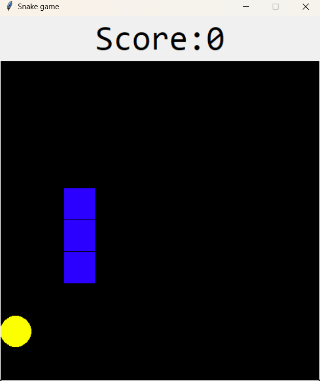

# Python Snake Game

🐍 **Python Snake Game**  
A simple yet fun implementation of the classic Snake game built using Python's tkinter GUI library. Eat the yellow food, grow longer, and try not to crash into the walls or yourself!

---

## 🎮 Game Features
- 🧱 **Grid-based movement**
- 🍎 **Randomly spawned food**
- 🐍 **Snake grows with every food eaten**
- 💀 **Collision detection with walls and self**
- 🏁 **Game over screen**
- ⌨️ **Keyboard arrow controls**
- 🧪 **Written in pure Python with no external dependencies**

---

## 🛠 Requirements
- **Python 3.x** (recommended: 3.6+)
- **tkinter** (included with most standard Python installs)

---

## ▶️ How to Run

1. Clone the repository:
   ```bash
   git clone https://github.com/yourusername/PythonSnakeGame.git
   cd PythonSnakeGame

  ```markdown
# Python Snake Game

🐍 Python Snake Game 
A simple yet fun implementation of the classic Snake game built using Python's tkinter GUI library. Eat the yellow food, grow longer, and try not to crash into the walls or yourself!

---

## 🎮 Game Features
- 🧱 **Grid-based movement**
- 🍎 **Randomly spawned food**
- 🐍 **Snake grows with every food eaten**
- 💀 **Collision detection with walls and self**
- 🏁 **Game over screen**
- ⌨️ **Keyboard arrow controls**
- 🧪 **Written in pure Python with no external dependencies**

---

## 🛠 Requirements
- **Python 3.x** (recommended: 3.6+)
- **tkinter** (included with most standard Python installs)

---

## ▶️ How to Run

1. Clone the repository:
   ```bash
   git clone https://github.com/yourusername/PythonSnakeGame.git
   cd PythonSnakeGame
   ```

2. Run the game:
   ```bash
   python snake_game.py
   ```
   Replace `snake_game.py` with the actual filename if different.

---

## 🎯 How to Play
- Use the arrow keys to move:
  - ⬆️ **Up**
  - ⬇️ **Down**
  - ⬅️ **Left**
  - ➡️ **Right**
- Eat the yellow food to grow longer.
- Avoid crashing into walls or your own body.
- The game ends when a collision occurs.
- Your score is displayed at the top.

---

## 🖼️ Screenshot


---

## 📁 Project Structure
```plaintext
PythonSnakeGame/
│
├── snake_game.py         # Main game logic and GUI
├── README.md             # Project documentation

```

---

## 🧠 Future Improvements (Ideas)
- Add difficulty levels (e.g., speed increases over time)
- Wall wrap mode (snake continues through walls)
- Sound effects and background music
- High score tracking and leaderboard
- Pause and resume functionality

---

## 📄 License
This project is licensed under the **MIT License**.

---

## 🙌 Credits
Created with 💚 using Python and Tkinter.  
Inspired by the classic Nokia Snake game.


